<p align="center">
  
  
</p>
<p align="center">
   
  
</p>


<h2>Hello World, I'm Wandrys! </h2>


 <a target="_blank"></a>  <a target="_blank"></a>  <a target="_blank"></a> 
 
 
 <<a target="_blank"></a>  <a target="_blank"></a> 
 
 


| <a href="https://asciinema.org/a/375762" target="_blank"></a> | <a href="https://asciinema.org/a/375763" target="_blank"></a> | <a href="https://asciinema.org/a/375764" target="_blank"></a> |
|:--:| :--: |:--: |
| *No control* | *Swing-Up without Stabilization* |  *Swing-Up with Stabilization* |


<!-- About me image -->


<h3> 👨🏻‍💻 &nbsp;About Me  </h3>


- 🎓 I am a Accounting Sciences and Mathematics major and currently studying Statistics! 🐺
- 🤔 &nbsp; Exploring new technologies and developing software solutions and quick hacks.
- 💼 &nbsp; Passionate Programmer, Matlab Developer, problem solving Skills and a Competitive Programmer.
- 🌱 &nbsp; Learning more about Web Development, Database Management System, SQL and Familier with Data Science & ML.
- ✍️ &nbsp; Participation on Different Levels Innovation Cell Projects, etc.
- 📫 How to reach me: wandrys.sousa@protonmail.com ⚛️
- ⚡ Fun fact: I love listening to music and playing the guitar! 🎸


I love APIs, coffee, and the Oxford comma. I am a full stack mathematician working in Matlab and Python. I have excelled in various roles in the Software Development Life Cycle. I have always enjoyed seeing ideas come to life in my programs. I love to ship elegant code that solves real problems, and iterate based on real customer feedback. I want to write software that improves people's lives, and that supports our skills and enriches our relationships outside the virtual world.


## Like My Work? : <a href="https://avatars.githubusercontent.com/u/44137944?v=4"></a>

<a href="https://www.buymeacoffee.com/Wandrys" target="_blank"></a>


<h3> 🛠 &nbsp;Tech Stack</h3>

- 💻 &nbsp;
  
  
  
  
  
  
  
  
  
  

- 🌐 &nbsp;
  
  
  
  
  
  
  
- 🛢 &nbsp;
  
  
  
  
- ⚙️ &nbsp;
  
  
  
- 🔧 &nbsp;
  
  

<br/>


<h3> 🤝🏻 &nbsp;Connect with Me  </h3>

## Social

<p align="center">
<a href="https://twitter.com/Wandrys_"></a>
<a href="https://www.instagram.com/matematico_do_planalto_central/"></a>
<a href="mailto:wandrys@gmail.com"></a>
</p>


## 🌐 Connect with me:
[](https://www.linkedin.com/in/wandrys-nascimento-021aa093/) 


## 📈 My GitHub Stats 


<div align=center>
          
    </div>

<div align=center>
        
    </div>


### 🏆 Trophies

[](https://github.com/ryo-ma/github-profile-trophy)


### 📊 Overall Stats

<table>
  <tr>
    <td>
      <a href="https://github.com/Wandrys-dev/github-readme-stats">  </a>
    </td>
    <td>
      <a href="https://github.com/Wandrys-dev/github-readme-stats">  </a>
    </td>
  </tr>
  <tr>
    <td colspan=2 align="center">
      <a href="https://git.io/streak-stats">  </a>
    </td>
  </tr>
</table>


<table width="100%"> 
  <tr>
    <td width="40%">
      
    </td>
    <td width="30%">
      
    </td>
    <td width="30%">
      
    </td>
  </tr>
</table>

<br/>


```python
#!/usr/bin/python
# -*- coding: utf-8 -*-

class ComputerEngineer:
    def __init__(self):
        self.name    = "Wandrys Nascimento"
        self.role    = "Data Scientist"
        self.contact = "wandrys.sousa@protonmail.com"
        self.work    = "Data Scientist, Software, Network Systems, Web Developer"
        self.learn   = "Image Processing and Game Programming"
    
    def getCity():
        return Brasilia_Brazil()

me = DataScientist()
```


[](https://github.com/Wandrys-dev/github-readme-activity-graph)


<p align="center"> 
  Visitors :<br>
  
</p>


<p align="center">
  
</p>
